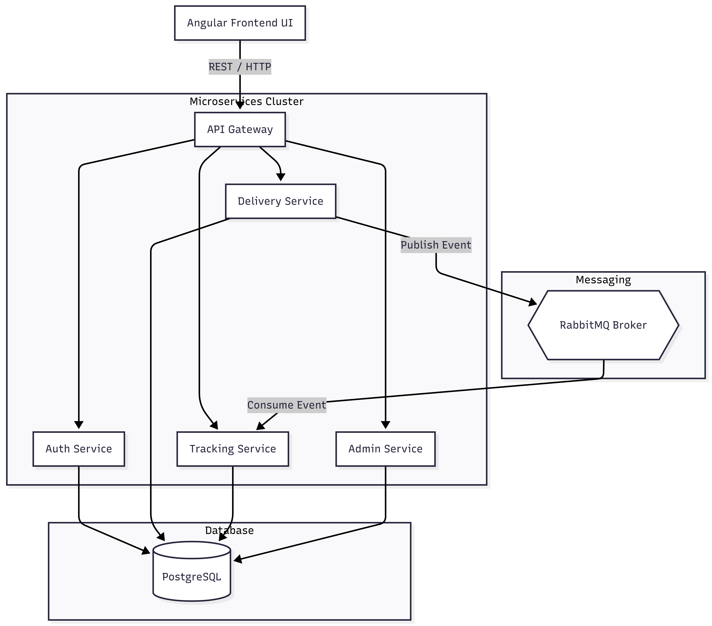
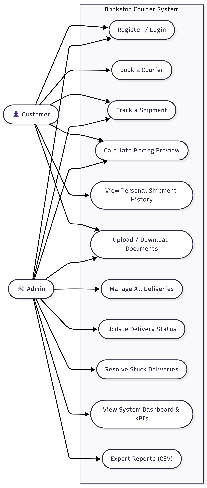

# Smart Courier Delivery Management System

A microservices-based courier management system built with Spring Boot, Spring Cloud, and Docker.

## Architecture Overview

The system consists of several microservices:
- **Eureka Server**: Service discovery.
- **Config Server**: Centralized configuration management (Remote Git).
- **API Gateway**: Entry point for all requests, handles routing and JWT security.
- **Auth Service**: User authentication and JWT management.
- **Delivery Service**: Core delivery lifecycle and pricing logic.
- **Tracking Service**: Real-time tracking updates via RabbitMQ.
- **Admin Service**: Orchestrator for reports and dashboards.

## Infrastructure & Monitoring
- **Postgres**: Independent databases for each microservice.
- **RabbitMQ**: Message broker for asynchronous event processing.
- **Zipkin**: Distributed tracing (Port 9411).
- **Prometheus**: Metrics collection and monitoring (Port 9090).
- **SonarQube**: Static code analysis and quality gate (Port 9000).

## Getting Started

### Prerequisites
- Java 17
- Maven 3.8+
- Docker & Docker Desktop

### Build Instructions
1. Build all services using the provided script (uses Maven Wrapper):
   ```powershell
   powershell.exe -ExecutionPolicy Bypass -File .\build-all.ps1
   ```

2. Start the infrastructure and services:
   ```bash
   docker-compose up -d
   ```

### Configuration Management
The system uses **Spring Cloud Config Server**.
- **Source**: Fetching configs from `https://github.com/JomainaAhmed/config-repo1`.
- **Requirements**: Ensure internet access for the Config Server to clone the repository.
- **Prometheus Metrics**: Ensure your remote configurations enable metrics exposure:
  ```yaml
  management:
    endpoints:
      web:
        exposure:
          include: "*"
  ```

## Key Features Implemented
- **Lombok**: Reduced boilerplate code across all services.
- **SLF4j Logging**: Console and File appenders enabled for all functional services.
- **Jacoco**: Code coverage analysis integrated into the Maven build.
- **Async Tracking**: Delivery updates are processed asynchronously via RabbitMQ.

## API Documentation & Dashboards
- **Swagger UI**: `http://localhost:8080/swagger-ui.html`
- **Prometheus**: `http://localhost:9090`
- **Eureka Dashboard**: `http://localhost:8761`
- **Zipkin**: `http://localhost:9411`
- **SonarQube**: `http://localhost:9000`

## Frontend (Angular & Tailwind CSS)
The system includes a premium frontend built with **Angular** and **Tailwind CSS**.
- **Location**: `courier-management-ui/`
- **Styling**: Tailwind CSS v3 with Glassmorphism effects.
- **Features**: JWT Auth, User Dashboard, Admin Reports.

### Running the Frontend
1. Navigate to the directory:
   ```bash
   cd courier-management-ui
   ```
2. Install dependencies:
   ```bash
   npm install
   ```
3. Start the dev server:
   ```bash
   npm start
   ```
The UI will be available at `http://localhost:4200`.

## Testing & Quality
To run unit tests for the Delivery Service:
```bash
cd delivery-service
./mvnw test
```

### Running SonarQube Analysis
1. Ensure SonarQube is running: `docker-compose up -d sonarqube`
2. Run the scan script for all services:
   ```powershell
   powershell.exe -ExecutionPolicy Bypass -File .\scripts\sonar-scan.ps1
   ```
3. View results at `http://localhost:9000` (Default login: admin/admin)

4. ---

# System Architecture



The Smart Courier Delivery Management System follows a distributed microservices architecture built using Spring Boot and Spring Cloud. The Angular frontend communicates with the API Gateway, which routes requests to individual backend services. RabbitMQ enables asynchronous communication between services, while PostgreSQL stores operational data.

### Core Components

| Component | Responsibility |
|------------|---------------|
| API Gateway | Centralized routing, JWT validation, request forwarding |
| Auth Service | User authentication and JWT token management |
| Delivery Service | Courier booking, pricing calculations, QR generation |
| Tracking Service | Shipment tracking and activity logging |
| Admin Service | Reports, dashboards, delivery management |
| RabbitMQ | Event-driven communication |
| PostgreSQL | Persistent storage |
| Eureka Server | Service registration and discovery |
| Config Server | Centralized configuration management |

---

# Use Case Diagram



The system supports two primary actors:

### Customer
- Register / Login
- Book a Courier
- Track a Shipment
- Calculate Pricing Preview
- View Shipment History
- Upload & Download Documents

### Administrator
- Manage Deliveries
- Update Delivery Status
- Resolve Failed Deliveries
- View Dashboard & KPIs
- Export Reports

---

# Courier Booking Workflow


### Booking Process

1. User fills courier booking form.
2. Angular validates package dimensions and weight.
3. Request is sent through API Gateway.
4. Delivery Service calculates pricing.
5. Delivery details are stored in PostgreSQL.
6. A booking event is published to RabbitMQ.
7. Tracking information is generated.
8. User receives booking confirmation.

---

# Shipment Tracking Architecture


Tracking updates are processed asynchronously using RabbitMQ.

### Benefits

- Event-driven architecture
- Loose service coupling
- Better scalability
- Faster response times
- Improved fault tolerance

---

# Database Design


### Main Entities

#### Users
Stores customer and administrator credentials.

#### Address
Stores sender and receiver information.

#### Package Entity
Stores parcel dimensions, weight, and pricing.

#### Delivery
Stores delivery status and shipment details.

#### Tracking
Maintains shipment history and location updates.

---

# Service Discovery


Spring Cloud Eureka enables automatic service registration and discovery. Services dynamically register themselves and the API Gateway uses Eureka to locate healthy instances.

---

# API Documentation


Swagger/OpenAPI documentation is available for:

- Auth Service
- Delivery Service
- Tracking Service
- Admin Service

The documentation is exposed through the API Gateway for centralized API exploration and testing.

---

# Distributed Tracing


Zipkin provides distributed tracing across all microservices, making it easier to:

- Trace requests
- Analyze latency
- Debug service interactions
- Monitor performance bottlenecks

---

# Message Broker


RabbitMQ powers asynchronous event-driven communication between services.

### Event Flow

Delivery Service
→ RabbitMQ Exchange
→ Tracking Queue
→ Tracking Service

This architecture improves reliability and scalability by decoupling producers and consumers.

---

# Frontend (Angular + Tailwind CSS)

## Landing Page


## Services Page


## Parcel Booking Interface


## Authentication


### Features

- JWT Authentication
- Responsive Design
- Shipment Tracking
- Courier Booking
- Delivery History
- Admin Operations
- Modern Tailwind UI

---

# Demo Videos

## Complete Project Demonstration

https://youtu.be/eVhZzyJQdl0

## SonarQube Setup & Analysis

https://youtu.be/augClel4vZA

## BlinkShip Frontend Demonstration

https://youtu.be/eVhZzyJQdl0

---
