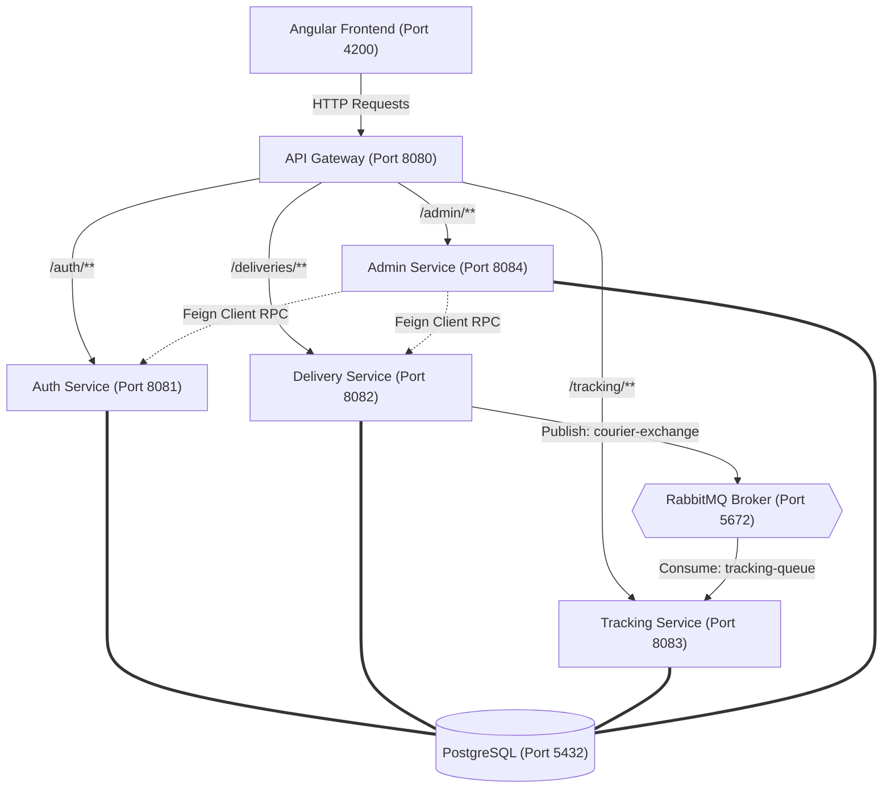
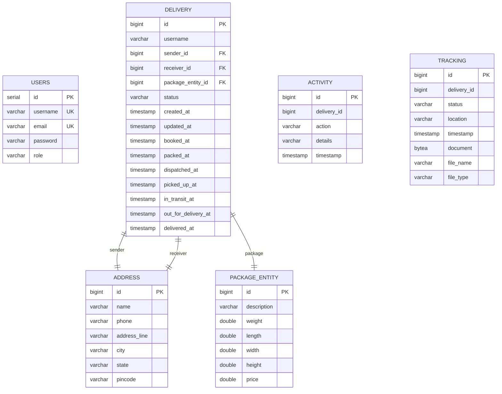

# Smart Courier Delivery Management System (Blinkship)
## Complete Technical & Functional Architecture Report (Simplified Architecture Diagram)

This report provides a comprehensive analysis of the **Smart Courier Delivery Management System** (commercially branded as **Blinkship**), a microservices-based logistics platform. It details the system architecture, individual services, asynchronous processing workflows, database schemas, security flows, frontend UI structure, dependencies, and DevOps/monitoring setups.

---

## 1. Executive Summary & Core Functionalities

**Blinkship** is designed to orchestrate the lifecycle of courier booking, pricing, real-time tracking, document management, and reporting. The system uses a modern, decentralized microservices approach to ensure high scalability, reliability, and security.

### Core Capabilities:
*   **Volumetric & Chargeable Weight Pricing:** Automatically calculates package delivery pricing based on either physical weight or volumetric dimensions (using the industry-standard formulas).
*   **Asynchronous Processing:** Decoupled courier tracking updates via a RabbitMQ broker to ensure sub-millisecond response times for core status updates.
*   **Automated Invoice Generation:** Dynamically generates PDF invoices embedded with ZXing-based custom tracking QR codes that link back to the tracking portal.
*   **Security & Guarded Operations:** State-of-the-art token security via a global API Gateway JwtFilter, coupled with localized zero-trust JwtFilters inside individual downstream services.
*   **Proof of Delivery & Document Uploads:** Allows users and admins to upload physical documentation and receipt files which are stored locally or persisted as binary data streams.
*   **Comprehensive Monitoring:** Centralized tracing (Zipkin), metric ingestion (Prometheus/Actuator), static code analysis (SonarQube), and central configuration management (Spring Cloud Config).

---

## 2. Microservices Architecture & System Topography

The backend is built as a set of spring-based microservices coordinated via **Spring Cloud Netflix Eureka** and routed through **Spring Cloud Gateway**. 

### System Topography & Core Request Flow

The diagram below details the simplified runtime request flow, showing how requests travel from the frontend through the gateway to individual services, as well as the asynchronous event-driven tracking updates.



### Cross-Cutting Infrastructure Services

To keep the runtime request diagram clean, the following infrastructural components run in the background to coordinate, configure, and monitor the microservices:

*   **Eureka Discovery Server (Port 8761):** Handles service registration so components (like the Gateway and Feign Clients) can find each other dynamically by name rather than hardcoded URLs.
*   **Spring Cloud Config Server (Port 8888):** Dynamically pulls configuration files from the remote Git repository (`config-repo1`) and provides them to all services on startup.
*   **Zipkin Server (Port 9411):** Collects and visualizes distributed tracing spans sent by services via Micrometer Tracing to track request paths across microservice bounds.
*   **Prometheus Server (Port 9090):** Regularly pulls metrics from the `/actuator/prometheus` endpoints of all active microservices to monitor system health.

---

## 3. Microservice Catalog & Internal Specifications

### 3.1 Eureka Server (`eureka-server`)
*   **Role:** Service Registry & Discovery Server.
*   **Port:** `8761`
*   **Configuration Details:**
    *   Runs in standalone mode (`register-with-eureka=false` and `fetch-registry=false`).
    *   Monitors registration health and allows microservices to look up routes dynamically by service IDs.

### 3.2 Config Server (`config-server`)
*   **Role:** Centralized Configuration Manager.
*   **Port:** `8888`
*   **Remote Configuration:** Fetching properties from Git repository `https://github.com/JomainaAhmed/config-repo1` on start-up.
*   **Robustness:** Downstream services use `fail-fast=true` along with a retry mechanism (maximum 10 attempts, starting at 2s up to 10s intervals) to ensure they safely boot once configurations are online.

### 3.3 API Gateway (`api-gateway`)
*   **Role:** Entry Point, Route Dispatcher, CORS Configurator, and Initial Token Validator.
*   **Port:** `8080`
*   **Routing Schema:**
    *   `/auth/**` $\rightarrow$ `lb://AUTH-SERVICE`
    *   `/deliveries/**` $\rightarrow$ `lb://DELIVERY-SERVICE`
    *   `/tracking/**` $\rightarrow$ `lb://TRACKING-SERVICE`
    *   `/admin/**` $\rightarrow$ `lb://ADMIN-SERVICE`
*   **Security Interception (`JwtFilter.java`):**
    *   Validates JWT Bearer tokens for all non-public routes (e.g. bypasses `/auth/signup`, `/auth/login`, and `/actuator` / Swagger paths).
    *   Restricts `/admin/**` paths strictly to users possessing the `ADMIN` role.
    *   Mutates incoming requests to propagate security context to downstream services by appending custom headers: `X-User` and `X-Role`.

### 3.4 Auth Service (`auth-service`)
*   **Role:** User Registration, BCrypt-based Login, and Token Provider.
*   **Port:** `8081` (Internal) | Mapped through Gateway.
*   **Core APIs:**
    *   `POST /auth/signup`: Accepts `SignupRequest` DTO. Validates email and username uniqueness in `auth_db2`. Hashes credentials with BCrypt. Registers roles (`USER` by default, or `ADMIN`).
    *   `POST /auth/login`: Verifies user password against database hashes. If valid, generates a signed JWT token containing claims for `username`, `role`, and `sub` (user's email).
    *   `GET /auth/users` (Admin only): Fetches all registered users.

### 3.5 Delivery Service (`delivery-service`)
*   **Role:** Booking Engine, Status Modifier, and Pricing Calculator.
*   **Port:** `8082` (Internal) | Mapped through Gateway.
*   **Key Logic & Functional Mechanics:**
    1.  **Pricing Calculation:** Takes a `PackageEntity` (dimensions and weight) and calculates volumetric weight:
        $$\text{Volumetric Weight (KG)} = \frac{\text{Length (cm)} \times \text{Width (cm)} \times \text{Height (cm)}}{5000}$$
        Sets $\text{Chargeable Weight} = \max(\text{Actual Weight}, \text{Volumetric Weight})$.
        Applies a base rate of INR 300 per chargeable unit:
        $$\text{Price} = \text{Chargeable Weight} \times 300$$
    2.  **PDF Invoice & QR Generation:** Uses ZXing to generate tracking QR codes: `http://localhost:4200/track?id={id}`. Converts code image to Base64, inserts it into an HTML template, and parses it into a raw PDF binary stream via **iText HTML Converter** (`HtmlConverter.convertToPdf`).
    3.  **Local File System Uploads:** Exposes paths under `/deliveries/documents` to upload transit files, automatically renaming documents using unique UUID prefixes (`UUID_Filename`) and saving them under local directories (`uploads/`).
    4.  **Messaging Publication:** On shipment creation/status modification, publishes a JSON `TrackingMessage` containing `{deliveryId, status}` onto the RabbitMQ exchange.
*   **Route Schema:**
    *   `POST /deliveries/create` (User/Admin): Books courier.
    *   `GET /deliveries/{id}` (Public): Fetches delivery by ID (used for public tracking query).
    *   `PUT /deliveries/{id}/status` (Admin): Programmatic status progression.
    *   `GET /deliveries/all` (Admin): Fetches all shipments.
    *   `GET /deliveries/user/{username}` (User/Admin): Fetches shipment log of the user.
    *   `POST /deliveries/calculate` (Public): Price calculator preview.
    *   `GET /deliveries/{id}/activities` (User/Admin): Lists history of audited status actions.
    *   `GET /deliveries/export/{username}` & `/deliveries/export/all` (User/Admin): Exports shipment tables as clean CSV files.

### 3.6 Tracking Service (`tracking-service`)
*   **Role:** Event Listener and Real-time Geolocation Tracer.
*   **Port:** `8083` (Internal) | Mapped through Gateway.
*   **Event Handling (`TrackingConsumer.java`):**
    *   Listens asynchronously to RabbitMQ queue `tracking-queue`.
    *   On packet ingestion, extracts status and generates location names dynamically based on the current delivery state:
        *   `BOOKED` $\rightarrow$ *"Origin Hub"*
        *   `PICKED_UP` $\rightarrow$ *"Pickup Location"*
        *   `IN_TRANSIT` $\rightarrow$ *"Transit Hub"*
        *   `OUT_FOR_DELIVERY` $\rightarrow$ *"Local Hub"*
        *   `DELIVERED` $\rightarrow$ *"Delivered"*
        *   Default/Fallback $\rightarrow$ *"Processing Center"*
    *   Saves a record to tracking database `tracking_db2`.
*   **Binary Document Uploads:**
    *   Allows uploading tracking files directly to the database stored as raw binary streams (`BYTEA` column) inside PostgreSQL, with download routes secured via JWT.
*   **Route Schema:**
    *   `GET /tracking/{deliveryId}` (Public): Returns chronological route/transit logs.
    *   `POST /tracking/{deliveryId}/upload` (Public): Associated document upload.
    *   `GET /tracking/{trackingId}/download` (User/Admin): Retrieves stored document binary.

### 3.7 Admin Service (`admin-service`)
*   **Role:** Monitoring Dashboard Orchestrator and Exception Resolver.
*   **Port:** `8084` (Internal) | Mapped through Gateway.
*   **OpenFeign Client Integration:**
    *   Integrates Feign Client interfaces `AuthClient` and `DeliveryClient` to aggregate distributed resources.
    *   Uses `FeignConfig` to intercept outgoing Feign calls and inject the original client's `Authorization` Bearer token into headers, ensuring secure microservices authentication forwarding.
*   **KPI Statistics Calculations:**
    *   Computes dashboard KPIs: total deliveries, success rates, failure metrics, delayed rates, and status distribution counts.
*   **Exception Resolver:**
    *   Allows admins to resolve "blocked" states:
        *   `DELAYED` $\rightarrow$ resolves back to `IN_TRANSIT`.
        *   `FAILED` $\rightarrow$ resolves to `RETURNED`.
*   **Route Schema:**
    *   `GET /admin/dashboard` (Admin): General stats counts.
    *   `GET /admin/deliveries` (Admin): All shipments.
    *   `PUT /admin/deliveries/{id}/resolve` (Admin): Trigger exception resolution.
    *   `PUT /admin/deliveries/{id}/status` (Admin): Update shipment status.
    *   `GET /admin/reports` (Admin): Visual report percentages (success/failure rates).
    *   `GET /admin/users` (Admin): Returns all application users.

---

## 4. Database Schema Specifications

The project leverages a single **PostgreSQL 15** container separating concerns by running five independent database schemas: `auth_db2`, `delivery_db2`, `tracking_db2`, `admin_db2`, and `sonarqube`.



---

## 5. DevOps, Messaging, & Observability Setup

### 5.1 Asynchronous Messaging (RabbitMQ)
*   **Exchange:** `courier-exchange` (Topic exchange)
*   **Queue:** `tracking-queue`
*   **Routing Key:** `courier-routing-key`
*   *Flow:* Any status progression in `delivery-service` fires an asynchronous event. `tracking-service` picks up the payload in a thread pool and updates transit trails, preventing delivery operations from slowing down due to tracking database updates.

### 5.2 Distributed Tracing & Monitoring
*   **Zipkin Server:** Mapped to port `9411`. All microservices incorporate `micrometer-tracing-bridge-brave` and `zipkin-reporter-brave` to auto-propagate trace IDs across gateway requests and feign RPC calls.
*   **Prometheus Server:** Mapped to port `9090`. Ingests system metrics via target routes pointing to `/actuator/prometheus` inside each docker container.
*   **Static Scan (SonarQube):** Mapped to port `9000`. Runs deep scans utilizing maven verify steps mapped inside `./scripts/sonar-scan.ps1`.

---

## 6. Frontend Architecture (Angular 21 + Tailwind CSS)

Located under [courier-management-ui](file:///c:/Sprint%20Implementation/SmartCourierDeliveryManagementSystemDocker/courier-management-ui), the client application provides a modern dashboard built on Angular 21 with glassy responsive styles.

### Component Map & Router Configuration:

*   **Public Landing:**
    *   `/` $\rightarrow$ `HomeComponent`: Hero sections, landing info.
    *   `/services` $\rightarrow$ `ServicesComponent`: List of delivery methods.
    *   `/track` $\rightarrow$ `TrackComponent`: Public tracker using shipment ID query parameters. Displays detailed timeline status with location cards.
*   **Guarded Client Console (`authGuard`):**
    *   `/login` / `/signup` $\rightarrow$ Authenticate user credentials.
    *   `/dashboard` $\rightarrow$ `DashboardDto` data consumer. Visualizes core activity states.
    *   `/book` $\rightarrow$ `BookCourierComponent`: Delivery calculator with dimensions check, price estimator, and pickup/delivery address forms.
    *   `/profile` $\rightarrow$ User information display.
    *   `/my-deliveries` $\rightarrow$ Lists shipments matching sender username, downloads invoices (PDF format), and uploads package documentation files.
*   **Guarded Admin Portal (`adminGuard`):**
    *   `/admin` $\rightarrow$ `AdminComponent`: General management control, lists all packages across users, allows editing shipment stages, triggers delayed resolutions, displays system statistics, and exports master files to CSV.

---

## 7. System Dependency Registry

### 7.1 Backend (Java Maven - pom.xml)
Below is the aggregated dependency stack compiled from the microservice pom files:

| Group ID | Artifact ID | Version | Description |
| :--- | :--- | :--- | :--- |
| **org.springframework.boot** | spring-boot-starter-web | *Managed by Parent (3.5.13)* | REST APIs hosting |
| **org.springframework.boot** | spring-boot-starter-data-jpa | *Managed by Parent* | Relational database mapping |
| **org.springframework.boot** | spring-boot-starter-security | *Managed by Parent* | Security filters and context |
| **org.springframework.boot** | spring-boot-starter-actuator | *Managed by Parent* | System observability metrics |
| **org.springframework.cloud** | spring-cloud-starter-netflix-eureka-client | *Managed by Cloud (2025.0.1)* | Registry registration |
| **org.springframework.cloud** | spring-cloud-starter-config | *Managed by Cloud* | Central remote config fetch |
| **org.springframework.cloud** | spring-cloud-starter-openfeign | *Managed by Cloud* | Microservices RPC calls |
| **org.postgresql** | postgresql | *Runtime* | Postgres SQL database driver |
| **io.jsonwebtoken** | jjwt-api / jjwt-impl / jjwt-jackson | `0.11.5` | JWT creation and verification |
| **org.springdoc** | springdoc-openapi-starter-webmvc-ui | `2.8.16` | Swagger UI generation |
| **io.micrometer** | micrometer-registry-prometheus | *Managed by Parent* | Prometheus metric format |
| **io.micrometer** | micrometer-tracing-bridge-brave | *Managed by Parent* | Braving framework tracing |
| **io.zipkin.reporter2**| zipkin-reporter-brave | *Managed by Parent* | Zipkin span reporter |
| **org.projectlombok** | lombok | *Provided* | Getter/Setter boilerplate removal |
| **com.google.zxing** | core / javase | `3.5.3` | QR code generation engine |
| **com.itextpdf** | html2pdf | `5.0.2` | HTML templates to PDF engine |

### 7.2 Frontend (Node.js - package.json)
Key client packages located in `courier-management-ui/package.json`:

*   **Core Web Application:**
    *   `@angular/core` / `@angular/common` / `@angular/router` / `@angular/forms` / `@angular/platform-browser` $\rightarrow$ `^21.2.0`
    *   `@angular/animations` $\rightarrow$ `^21.2.11`
    *   `rxjs` $\rightarrow$ `~7.8.0`
*   **Design & Development Tools:**
    *   `tailwindcss` $\rightarrow$ `^3.4.19`
    *   `autoprefixer` $\rightarrow$ `^10.5.0`
    *   `postcss` $\rightarrow$ `^8.5.12`
    *   `typescript` $\rightarrow$ `~5.9.2`
    *   `vitest` $\rightarrow$ `^4.0.8`

---

## 8. Run Scripts & System Bootstrap Guide

### 8.1 Setup Prerequisites
*   Java SDK 17+ Installed.
*   NodeJS 20+ Installed.
*   Docker & Docker Desktop running on host machines.

### 8.2 Application Build Instructions
To build the microservices (bypassing unit tests for speed):
```powershell
powershell.exe -ExecutionPolicy Bypass -File .\scripts\build-all.ps1
```

### 8.3 Infrastructure Orchestration
Start container orchestration (Databases, Messaging, Discovery, Config, Services, and Tracing/Metrics servers):
```bash
docker-compose up -d --build
```

### 8.4 Quality Assurance & Scanning
To trigger static code analyzer scan for all microservices in SonarQube:
```powershell
powershell.exe -ExecutionPolicy Bypass -File .\scripts\sonar-scan.ps1
```

### 8.5 Running Angular Dev Server
To start UI in local development:
```bash
cd courier-management-ui
npm install
npm start
```
*Navigating to `http://localhost:4200` launches the **Blinkship** platform interface.*
