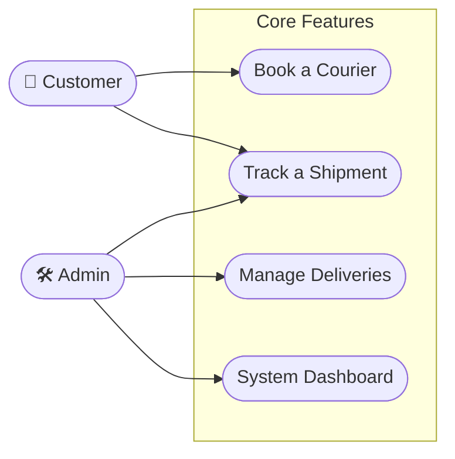
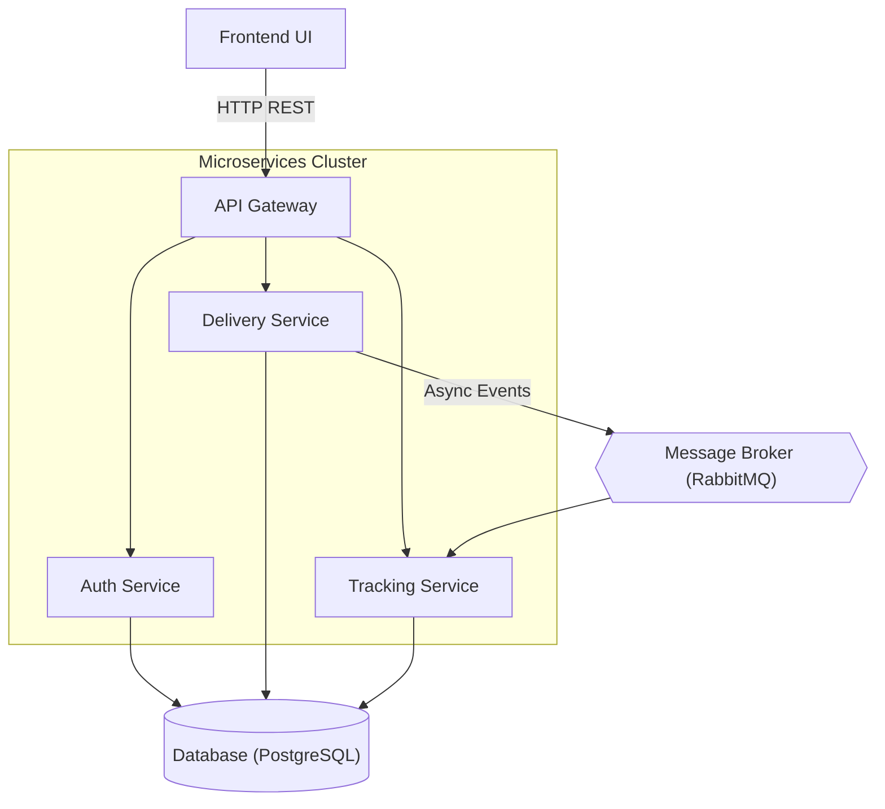
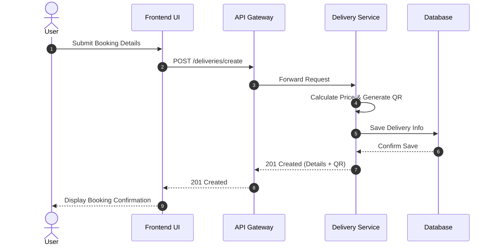

# Simplified System Diagrams for PowerPoint

These diagrams have been simplified to reduce visual clutter, making them ideal for PowerPoint slides or executive presentations.

## 1. Simplified Use Case Diagram
Highlights only the core interactions for the main actors.

## 2. Simplified System Architecture Diagram
Focuses on the main flow of data from the client to the microservices and databases, abstracting away infrastructural components like Eureka and Config.

## 3. Simplified Shipment Booking Sequence Diagram
A straightforward look at the booking flow without the deep technical details (like JWT filtering or RabbitMQ publishing steps).

