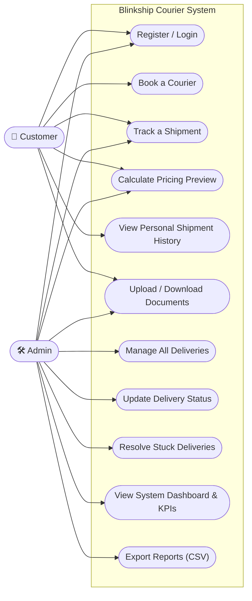
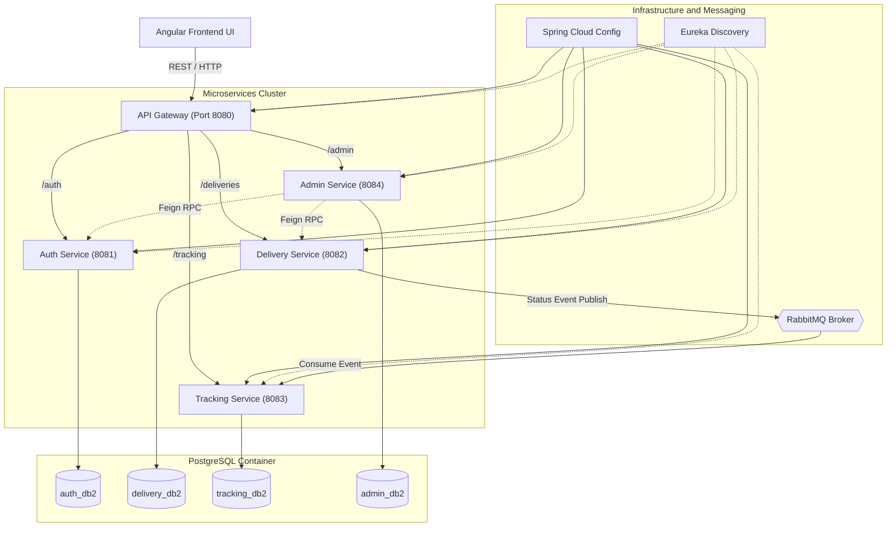
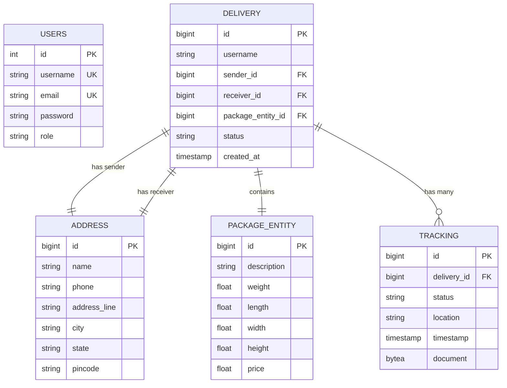
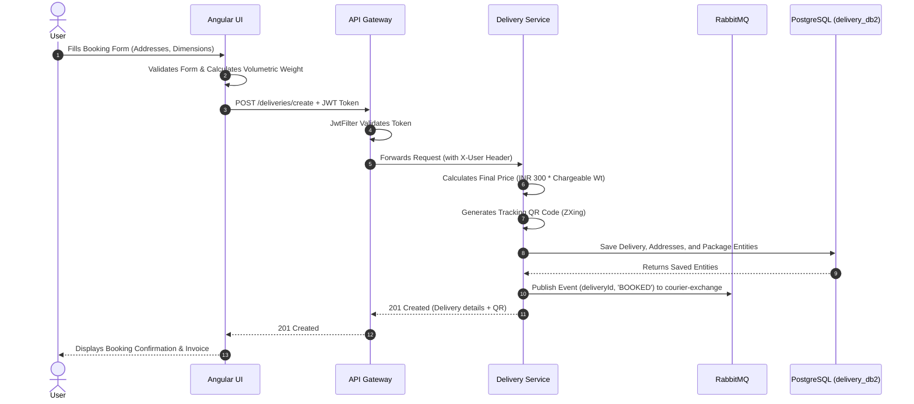
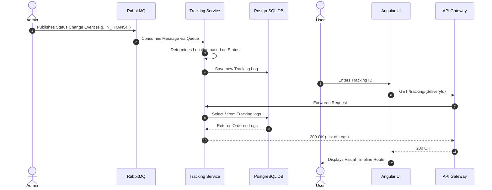
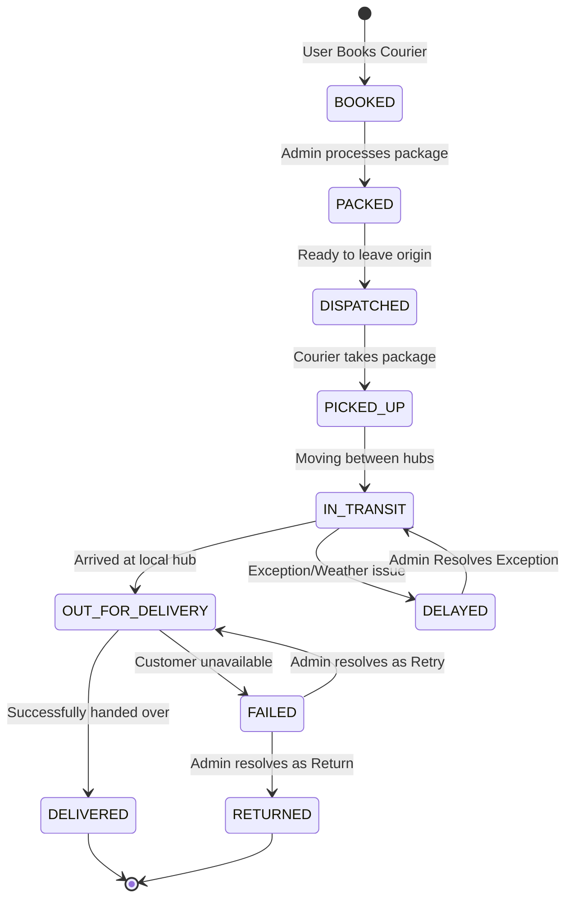
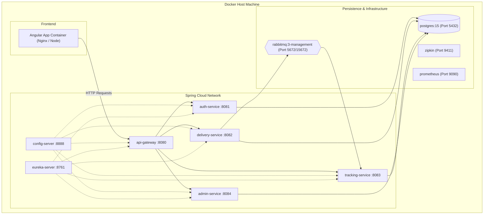
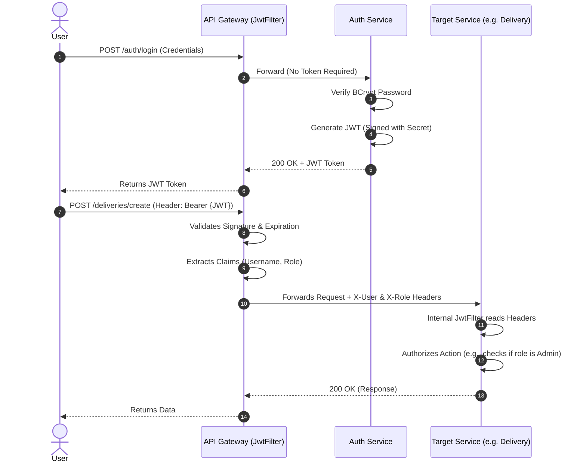
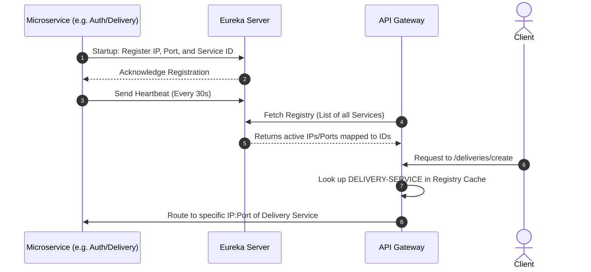

# System Diagrams for Smart Courier Delivery Management System

Below is the complete set of requested diagrams for your report. You can embed these directly into your markdown documents, as they use standard Mermaid.js syntax which is widely supported by GitHub, GitLab, Notion, and most markdown editors.

## 1. Use Case Diagram
This diagram illustrates the primary actors (Customer and Admin) and their interactions with the system's features.



## 2. System Architecture Diagram
A high-level view of how the microservices, infrastructure, and frontend interact.



## 3. Entity Relationship (ER) Diagram
The core data structure spread across the various microservice databases.



## 4. Sequence Diagram (Booking)
The step-by-step API flow when a user books a new courier delivery.



## 5. Sequence Diagram (Tracking)
Shows both the asynchronous tracking event update and the user retrieving the tracking timeline.



## 6. Activity Diagram
The lifecycle and states of a package delivery from booking to delivery or return.



## 7. Deployment Diagram
How the Docker containers are deployed and orchestrated on the host machine.



## 8. Authentication Flow Diagram
The zero-trust security model implemented using JWTs across the API Gateway and microservices.



## 9. RabbitMQ Asynchronous Messaging Flow
This diagram details the pub/sub event-driven architecture using RabbitMQ for decoupled tracking updates.

```mermaid
graph LR
    subgraph Publisher ["Publisher"]
        Delivery["Delivery Service (Producer)"]
    end
    
    subgraph Broker ["RabbitMQ Broker"]
        Exchange{"Exchange: courier-exchange"}
        Queue["Queue: tracking-queue"]
        
        Exchange -->|Routing Key: courier-routing-key| Queue
    end
    
    subgraph Consumer ["Consumer"]
        Tracking["Tracking Service (Consumer)"]
    end
    
    Delivery -->|Publish: {deliveryId, status}| Exchange
    Queue -->|Consume Message Thread| Tracking
```

## 10. Service Discovery (Eureka) Flow
This illustrates how microservices register themselves on startup and how the API Gateway dynamically routes traffic without hardcoded IPs.


